<div align="center">

🇧🇷 [Português](https://github.com/fabious054/fabious054/blob/main/README.md) · 🇺🇸 [English](https://github.com/fabious054/fabious054/blob/main/README.en.md)


<a href="https://git.io/typing-svg"></a>

<br/>

<a href="https://www.instagram.com/fhenrique.dev"></a>

</div>

---

### 👋 About me

I'm a developer based in Brazil and the founder of **CodeWave.IT**, where I build my own products with a practical, entrepreneurial mindset. I use AI as real working infrastructure: agents, MCP servers and automations that expand what a single person can deliver.

What drives me is studying increasingly complex things and refining what I already know. I also create content about software development on Instagram and LinkedIn.

```ts
const fabio = {
  company: "CodeWave.IT",
  focus: ["Applied AI", "MCP & agents", "APIs", "Cloud"],
  learning: "always something one step harder",
  philosophy: "Make it work, make it right, make it fast.",
};
```

---

### 🛠️ Stack

<div align="center">


</div>

---

### 🚀 Featured

<table>
<tr>
<td width="50%" valign="top">

#### 🔌 [GitHub MCP](https://github.com/fabious054/github-mcp)
An MCP server that gives Claude real access to GitHub: branches, commits, PRs, issues and code search. Multi-account OAuth, Redis-backed rate limiting, atomic commits via the Git Data API, and design decisions documented as ADRs.

`TypeScript` `MCP` `Vercel` `Redis`

</td>
<td width="50%" valign="top">

#### 🧪 In progress at CodeWave.IT
- **CostTracer** — cost tracking
- **AgentMesh** — agent orchestration
- **CandleCLI** — command-line tool
- **PimelStore** — e-commerce (API + UI)

<sub>Private repositories for now.</sub>

</td>
</tr>
</table>

---

### 📊 Activity

<div align="center">





</div>

---

<div align="center">

<sub>⭐ Like a project? Leave a star or reach out.</sub>


</div>
